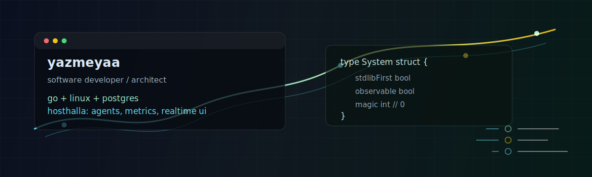

# Eugene Antonenkov / yazmeyaa

> Software Developer / Software Architect.  
> XXVIII yo. Extreme developer.

I build backend systems, infrastructure tools, and small engines. I care about
code that is easy to understand, operate, debug, and change over time.

My main stack is **Go**, **Linux**, and **PostgreSQL**. I like explicit
architecture: clear boundaries, small interfaces, minimal dependencies, and
runtime behavior that can be observed and debugged.

I prefer simple, explicit systems where the important parts are visible and
easy to reason about.

## Current Focus

```txt
main focus    Hosthalla: server management, agents, metrics, notes, SSH, realtime UI
core stack    Go, PostgreSQL, Linux, Docker, net/http, templ, htmx
systems       Event Bus, WebSocket/SSE, background workers, installers, releases
other work    TypeScript ECS, data structures, canvas/WebGL, small automation tools
principles    stdlib first, Linux-first, clear interfaces, no heavy dependencies
website       https://magic-lizard.ru
```

## Working On

| Project | Description |
| --- | --- |
| [hosthalla](https://github.com/yazmeyaa/hosthalla) | A Go platform for host management, monitoring, agents, notes, SSH access, and realtime server UI. |
| [draug-engine](https://github.com/yazmeyaa/draug-engine) | A lightweight TypeScript ECS game engine focused on deterministic gameplay logic. |
| [bitmap-index](https://github.com/yazmeyaa/bitmap-index) | TypeScript bitmap indexing for set operations and bitmasking. |
| [ts-sparse-set](https://github.com/yazmeyaa/ts-sparse-set) | Sparse set collections for ECS-style and ID-based data. |
| [vector2d](https://github.com/yazmeyaa/vector2d) | 2D vector math for games, physics, and graphical experiments. |
| [telegram_sticker_converter](https://github.com/yazmeyaa/telegram_sticker_converter) | Go tooling for converting Telegram stickers and animations. |

## Toolbox

```txt
languages      Go, TypeScript, Python, C/C++
backend        net/http, PostgreSQL, Redis, RabbitMQ, Docker, Nginx
frontend       React, Svelte/SvelteKit, Angular, templ, htmx
infra          Linux, systemd, Docker Compose, single-node Kubernetes
release        GitHub Actions, Goreleaser, GitHub Releases, installer scripts
```

## How I Usually Design Things

```go
type Approach struct {
    Dependencies string // use as few as the problem allows
    Interfaces   string // describe behavior, not implementation details
    Architecture string // keep boundaries clear and explicit
    Runtime      string // make the system observable and debuggable
    Scaling      string // think ahead, optimize when there is evidence
    LockIn       string // avoid it unless the trade-off is worth it
}
```

## Things I Keep Returning To

- Backend architecture and system design.
- Distributed systems explained in practical terms.
- PostgreSQL, queues, event-driven flows, and monitoring.
- Linux internals, systemd, networking, containers, and server infrastructure.
- WebSocket/SSE, realtime fan-out, agents, installers, and release pipelines.
- ECS, bitsets, sparse sets, deterministic simulation, and game-dev internals.
- Drawing with colored pencils, history, economics, and understanding why things work the way they do.

## Links

- GitHub: [github.com/yazmeyaa](https://github.com/yazmeyaa)
- Telegram: [@future_undefined](https://t.me/future_undefined)
- Website: [magic-lizard.ru](https://magic-lizard.ru)
- Email: [evgenijantonenkov456@gmail.com](mailto:evgenijantonenkov456@gmail.com)
